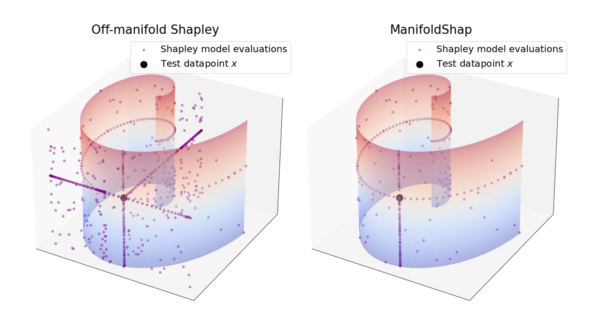

## Manifold Restricted Interventional Shapley Values

By [Muhammad Faaiz Taufiq](https://faaizt.github.io/), [Patrick Blöbaum](https://scholar.google.de/citations?user=0sqLy8cAAAAJ&hl=de), [Lenon Minorics](https://scholar.google.de/citations?user=Ghe1H3YAAAAJ&hl=en).  

This project is the official implementation of "Manifold Restricted Interventional Shapley Values" (currently under review).

## Introduction
Shapley values are model-agnostic methods for
explaining model predictions. Many commonly
used methods of computing Shapley values,
known as off-manifold methods, rely on model
evaluations on out-of-distribution input samples.
Consequently, explanations obtained are sensitive
to model behaviour outside the data distribution,
which may be irrelevant for all practical
purposes. While on-manifold methods have been
proposed which do not suffer from this problem,
we show that such methods are overly dependent 
on the input data distribution, and therefore 
result in unintuitive and misleading explanations. 
To circumvent these problems, we propose
ManifoldShap, which respects the model’s domain 
of validity by restricting model evaluations
to the data manifold. We show, theoretically and
empirically, that ManifoldShap is robust to off-manifold 
perturbations of the model and leads to
more accurate and intuitive explanations than existing 
state-of-the-art Shapley methods.

## Security

See [CONTRIBUTING](CONTRIBUTING.md#security-issue-notifications) for more information.

## License

This project is licensed under the Apache-2.0 License.

